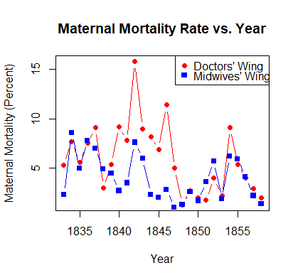
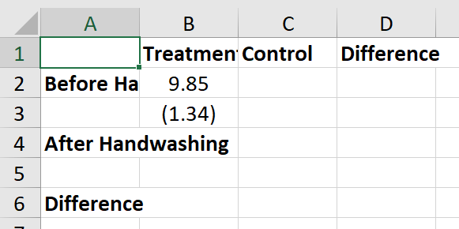

# Empirical Exercise 3
   
In this exercise, we're going to analyze data from Ignaz Semmelweis' handwashing intervention in the maternity hospital in Vienna.  The data come from 
Semmelweis' (1861) book, and [some helpful person put them on Wikipedia](https://en.wikipedia.org/wiki/Historical_mortality_rates_of_puerperal_fever#Yearly_mortality_rates_for_birthgiving_women_1784%E2%80%931849). 


We're going to be exporting estimation results to Excel using the `openxlsx` package, and we'll also be making figures. If you haven't done so already, type the following into the console in RStudio:

```
install.packages("openxlsx")
```
  
<br> 

## Getting Started  

Data on maternal mortality rates in Vienna are contained in the Excel file [E3-Semmelweis1861-data.xlsx](E3-Semmelweis1861-data.xlsx).  The spreadsheet 
inlcudes annual data from 1833 (when the Vienna Maternity Hospital opened its second clinic) through 1858.  Mortality rates are reported for Division 1 
(where expectant mothers were treated by doctors and medical students) and Division 2 (where expectant mothers were treated by midwives and trainee midwives from 1841 on). 
In Semmelweis' difference-in-differences analysis, Division 1 was the (ever-)treated group.  

Our first task is to import this Excel file into R. To do this, you should first click this link: [E3-Semmelweis1861-data.xlsx](E3-Semmelweis1861-data.xlsx). Now, this file is in your 'Downloads' folder as 'E3-Semmelweis1861-data.xlsx'. Next, in RStudio, navigate to the 'File' tab and select 'Import Dataset' and then 'From Excel'. A new window should appear. Click the 'Browse' button in the top right corner of this window, find 'E3-Semmelweis1861-data.xlsx' in your 'Downloads' folder, and select it. You should now be back at the window where you clicked 'Browse'. Finally, click 'Import' in the bottom corner of that window, and you've successfully imported the data! You can verify that the data was loaded by checking if 'E3_Semmelweis1861_data' appears in the 'Data' section of RStudio, which should be in the top right corner of your screen. Use the following command to make a copy of the data with a shorter name (this will make your life much easier).
```
E3data <- E3_Semmelweis1861_data
```
Below are some quick descriptions of the variables in the dataset:

| Variable | Description |
|----------|-------------|
| Births1  | Births in Division 1 (Treatment Group) |
| Deaths1 | Deaths in Division 1 (Treatment Group) |
| Rate1 | Mortality Rate in Division 1 (Treatment Group) |
| Births2  | Births in Division 2 (Comparison Group) |
| Deaths2 | Deaths in Division 2 (Comparison Group) |
| Rate2 | Mortality Rate in Division 2 (Comparison Group) |


Use the `summary()` function to familiarize yourself with the data set. What is the average maternal mortality rate in Division 1?  What is 
the average maternal mortality rate in Division 2?

The next lines of the code in the R Script graph maternal mortality rates in Division 1 and Division 2. When you run these lines, R should generate a figure that looks like this:



What patterns do you notice in this figure?  How do maternal mortality rates in the two divisions of the hospital compare?

Use the the following command to list the the notes contained in the data set by year:
```
E3data[is.na(E3data$Notes) == FALSE, c("Year", "Notes")]
```
This expression takes the rows of `E3data` that have notes (i.e. the 'Notes' variable is not NA, see the first part of the expression in the square brackets) and then lists out the "Year" and "Notes" columns of these particular rows. Subsetting a data frame in this way is an incredibly useful skill, and I'd encourage you to take some time to practice the skill yourself!

In what year did the hospital first move to the system where patients in Division 1 were treated by doctors and patients in Division 2 
were treated by midwives?  Drop the observations (years) before this happened by creating a new variable called `E3_splitclinic` that stores the appropriate subset of `E3data`.

_Make sure that you record this and all your subsequent commands in your R Script file so that you can re-run your code later._

Generate a `post` variable equal to one for years after the handwashing policy was implemented (and zero otherwise) using the `ifelse()` function. Remember that if you don't know how to use a particular function, you can type `help(function_name)` into the R console, and RStudio will help you figure it out. The command would be `help(ifelse)` in this particular case.  What is the mean postpartum mortality rate in the doctors' wing (Division 1) prior to the implementation of the handwashing policy?

Now let's put this result in a table!  We're going to use some functions in the `openxlsx` package to write our results into an Excel file. `openxlsx` 
is a useful package that allows you to write R output to a particular cell or set of cells in an Excel file. Before getting started 
with `openxlsx`, use the `getwd()` ("get working directory") command in the R console to make sure that you are writing your 
results to an appropriate file.  Use the `setwd()` function (used in previous exercises, check those out if you don't remember how to use it) to change your file path if necessary. Then set up the Excel file that will receive your results using the commands:

```
library(openxlsx)
E3wb <- createWorkbook()
addWorksheet(E3wb, "E3")
writeData(E3wb, sheet = "E3", data.frame(value = "Treatment"),
          startCol = "B", startRow = 1, colNames = FALSE)
writeData(E3wb, sheet = "E3", data.frame(value = "Control"),
          startCol = "C", startRow = 1, colNames = FALSE)
writeData(E3wb, sheet = "E3", data.frame(value = "Difference"),
          startCol = "D", startRow = 1, colNames = FALSE)
writeData(E3wb, sheet = "E3", data.frame(value = "Before Handwashing"),
          startCol = "A", startRow = 2, colNames = FALSE)
writeData(E3wb, sheet = "E3", data.frame(value = "After Handwashing"),
          startCol = "A", startRow = 4, colNames = FALSE)
writeData(E3wb, sheet = "E3", data.frame(value = "Difference"),
          startCol = "A", startRow = 6, colNames = FALSE)
saveWorkbook(E3wb, "E3wb.xlsx", overwrite = TRUE)
```

At this point, it is worth opening your Excel file to make sure that you are writing to it successfully.  **Be sure to close the file after you look at it**; R won't write over an open Excel file.  

Now that we know that our `openxlsx` functions are working, we can add the mean of the variable `Rate1` (the maternal mortality rate in Division 1) for the years prior to the introduction of handwashing. We're going to put the mean maternal mortality rate in Division 1 prior to the handwashing intervention in cell B2: the **Treatment** column, in the **Before Handwashing** row.

```
beforeMean <- mean(data.matrix(E3_splitclinic[E3_splitclinic$post == 0, "Rate1"]))
writeData(E3wb, sheet = "E3", data.frame(value = beforeMean),
          startCol = "B", startRow = 2, colNames = FALSE)
```

Notice that the variable being exported to Excel does not appear in quotes.  If you are writing a number or the value of a variable to Excel using the `writeData()` function, it does not need to appear in quotes (but sequences of letters and numbers - strings - do need double quotes). 

We can calculate the standard error of the mean by taking the standard deviation and dividing it by the square root of the number of 
observations.  What is the standard error of the mean postpartum mortality rate in the doctors' wing prior to Semmelweis' handwashing 
intervention? Use the code below to find out.

```
rate1Before <- data.matrix(E3_splitclinic[E3_splitclinic$post == 0, "Rate1"])
temp_se <- sd(rate1Before) / sqrt(length(rate1Before))
writeData(E3wb, sheet = "E3", data.frame(value = temp_se),
          startCol = "B", startRow = 3, colNames = FALSE)
saveWorkbook(E3wb, "E3wb.xlsx", overwrite = TRUE)
```

If we wanted to have our standard error appear in parentheses, we'd need to format the number *before* exporting to Excel.  We could do this using the following commands, which send the value to Excel as a string rather than as a number:

```
rate1Before <- data.matrix(E3_splitclinic[E3_splitclinic$post == 0, "Rate1"])
writeData(E3wb, sheet = "E3", data.frame(value = paste("(", temp_se, ")")),
          startCol = "B", startRow = 3, colNames = FALSE)
saveWorkbook(E3wb, "E3wb.xlsx", overwrite = TRUE)
```

At this point, it makes sense to check in on your Excel output again - just make sure to close the file after you look at it.  You should have something 
that looks similar to this:

  

<br>

## Empirical Exercise

_NOTE:  This empirical exercise differs from previous ones in that you will be graded based on your (R) code and your final output (the Excel table).  You will not be asked to enter any numbers into gradescope (but you do need to upload your R Script and Excel output there after you finish the exercise)._  

### Question 1

You can also get the standard error of a mean using R's `t.test()` function.  Use the command 

```
t.test(rate1Before)$stderr
```

to confirm that your standard error calculation (above) is correct. Now, let's figure out which values R generates and stores when you call the `t.test()` function. To do this, call the `help()` function on the `t.test()` function, and then scroll down to the 'Values' section of the help page. Note that you can call `t.test()$any_of_those_values` to extract any one of those values. What are the names of the mentioned values?


### Question 2 

Use the `mean()` and `t.test()` functions to calculate the mean and standard error for the other three cells required for difference-in-differences analysis:  the treatment group in the post-treatment period, the control group in the pre-treatment period, and the control gorup in the post-treatment period. Export these results to Excel using the `openxlsx` functions used above, or type them in manually (I'd recommend the latter in this case).

### Question 3 

Now run a t-test of the hypothesis that the mean maternal mortality rate in Division 1 was the same in the pre-treatment and post-treatment periods (using the `t.test()` function).  Use the means you found in Question 2 to find the difference in means, and use the syntax described in the second to last sentence of Question 1 to find the standard error of the difference in means.  Export the estimated difference in means and the estimated standard error of the difference in means to Excel, or type them in manually.

### Question 4 

Now do the same for Division 2:  run a t-test of the hypothesis that the mean maternal mortality rate in Division 2 was the same in the pre-treatment and post-treatment periods, and export your estimated difference in means to Excel together with the associated standard error.

### Question 5

Next, we want to test the hypothesis that the mean maternal mortality rate was the same in Division 1 and Division 2 prior to the handwashing intervention.  One approach is to do the calculations ourselves using the formulas.  We know the sample mean of the `Rate1` variable in the pre-treatment period, and we know how to use R to find the standard error of that mean (and, in fact, we have already recorded this standard error in our Excel table).  We also know the mean of the Rate2 variable and the associated standard error for the pre-treatment period.  Since these two means are independendent random variables, we know that the standard error of the estimated difference in means is the square root of the sum of the squared standard errors of the individual means.  Write a few lines of R code that would generate variables equal to the estimated difference in means and the standard error of that estimated difference.

### Question 6 

We can also use the `t.test()` function to test the hypothesis that the means of two variables are equal - you can read about this on the help page for `t.test`.  Confirm that the commands

```
# switch the variable names to whatever you called
# your subsets

# subtract the two values here
t.test(rate1Before, rateBefore)$estimate

t.test(rate1Before, rate2Before)$stderr
```

yield the same estimated difference in means and standard error that you calculated in Question 5. Then export your estimated difference in means and standard error to Excel.

### Question 7 

Now use the `t.test()` function to calculate the estimated difference in maternal mortality between Division 1 and Division 2 in the post-treatment period.  Export your difference in means and the associated standard error to Excel.

### Question 8 

Write R code to calculate the difference-in-differences estimator of the treatment effect of handwashing and export your results to Excel.

### Question 9 

Write R code to calculate the standard error of the difference-in-differences estimator of the treatment effect of handwashing and export your results to Excel.  Assume that the four cell means (treatment X pre, treatment X post, control X pre, control X post) are independent random variables.

<br> 

## More (Optional) Fun with Stata

### Graphing Your Diff-in-Diff

Modify the code near the top of the `do` file that generates the graph (code replicated below):  make a new version that plots only the data used in our difference-in-differences estimation.  The code uses the `twoway` command (check out the help file) that is useful for making all sorts of graphs.  You'll want to modify the `xlabel(1830(5)1860)` part of the code (which controls the scale of the x-axis) so that you only show a narrow window around the data you are plotting.  You may also want to add a line showing when the hospital instituted the handwashing policy.  You can do this by inserting the text `xline(1847)` somewhere *after* the comma in your `twoway` command.

```
twoway (connected Rate1 Year, color(vermillion) msymbol(o) msize(small) lw(thin)) /// 
	(connected Rate2 Year, color(sea) msymbol(t) msize(small) lw(thin)), ///
	ylabel(0(5)20) ytitle("Maternal Mortality (Percent)" " ") ///
	xlabel(1830(5)1860) xtitle(" ") ///
	legend(label(1 "Doctors' Wing") label(2 "Midwives' Wing") col(1) ring(0) pos(2))
graph export vienna-by-wing-fig1.png, replace
```

### Storing Results in Matrices

One way to avoid using the `putexcel` command over and over is to save your results in a Stata matrix.  You can create an empty matrix that is j rows by k columns using the command `matrix matrixname=J(j,k,.)`.  So, for example, if you wanted to make a matrix called `ddresults` with 6 rows and 3 columns, you could use the command: 

```
matrix ddresults=J(6,3,.)
```

You could then write your estimation results to this matrix using code that is similar to the code you used with the `putexcel` command.  For example, if you wanted to write the your maternal mortality results for Division 1 in the first column of the matrix `ddresults`, you might use the following code (after defining the empty matrix):

```
ttest Rate1, by(post)
matrix ddresults[1,1] = round(r(mu_1),0.01)
matrix ddresults[2,1] = round(r(sd_1)/sqrt(r(N_1)),0.01)
matrix ddresults[3,1] = round(r(mu_2),0.01)
matrix ddresults[4,1] = round(r(sd_2)/sqrt(r(N_2)),0.01)
matrix ddresults[5,1] = round(r(mu_1) - r(mu_2),0.01)
matrix ddresults[6,1] = round(r(se),0.01)
svmat ddresults
```

The `svmat` command at the end saves your results as a Stata matrix, which can then be converted into a variable or exported to Excel. Since the elements of the matrix are numbers and not strings, we can't use this approach to put our standard errors in parentheses (or to bold some coefficients and not others).  However, the `round` function truncates our results at two decimal places.

After saving a matrix in Stata, we can then export the whole thing using the `putexcel` command, indicating where the top-left cell should be placed.  So, for instance, to export our difference-in-differences results, we might use the command `putexcel B2=matrix(ddresults)` - but be careful, as this will write over your earlier work!

